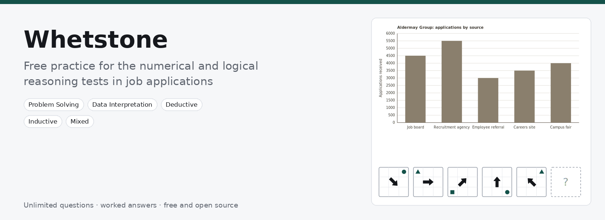

<p align="center">
  
</p>

<p align="center">
  <b>Free practice for the numerical and logical reasoning tests in job applications.</b><br>
  Unlimited fresh questions, a worked answer for every one, and an explanation of every wrong option.
</p>

<p align="center">
  <a href="https://mehta-seth.github.io/whetstone/"><b>Start practising</b></a> &nbsp;·&nbsp;
  <a href="#five-ways-to-practise">What you can practise</a> &nbsp;·&nbsp;
  <a href="#report-a-wrong-question">Report a wrong question</a> &nbsp;·&nbsp;
  <a href="#run-it-yourself">Run it yourself</a>
</p>

<p align="center">
  <a href="https://github.com/mehta-seth/whetstone/actions/workflows/test.yml"></a>
  
  
</p>

---

Online reasoning tests are a common early step in job applications, and practice makes a real
difference to how they go. Whetstone is a practice site for them. Pick a type of question, answer it
against the clock if you want to, and see straight away why the right answer is right and which
mistake leads to each wrong one.

It runs in your browser, needs no account, and keeps your progress on your own device.

## Five ways to practise

| | What you practise | Timed test |
| --- | --- | --- |
| **Problem Solving** | Word problems on budgets, discounts, rates, averages and ratios | 18 questions in 25 minutes |
| **Data Interpretation** | Tables and charts: shares, ratios and percentage changes | 20 questions in 15 minutes |
| **Deductive Reasoning** | Orders, groups and if-then rules: what must be true | 12 questions in 18 minutes |
| **Inductive Reasoning** | Number, letter and figure series: spot the rule | 15 questions in 18 minutes |
| **Mixed Reasoning** | Data, deductive and inductive questions in one sitting | 24 questions in 36 minutes |

Each has two buttons on the home screen. **Practise** starts a short untimed session with an
explanation after every question. **Timed test** starts the full set against one clock, with your
results at the end. **More options** lets you choose the difficulty, narrow the topics, change the
length and put a clock on each question.

## What feedback looks like

> Waverton entered 25 tenders last season and won 80% of them. Elmsby entered 20 tenders and won 35%.
>
> **Taken together, what percentage of the 45 tenders were won?**
>
> 35% &nbsp;·&nbsp; 55% &nbsp;·&nbsp; 57.5% &nbsp;·&nbsp; 60% &nbsp;·&nbsp; 80%

Choose 57.5% and Whetstone tells you that you averaged the two rates without weighting them,
(80 + 35) ÷ 2. Choose 55% and it tells you that you applied each rate to the other group. The answer,
60%, comes with its working: Waverton won 20, Elmsby won 7, and 27 of 45 is 60%.

Every wrong option in Whetstone is built from a specific, common mistake like these, so a wrong answer
tells you what to fix, not just that something went wrong.

## Features

- **Questions never run out.** 54 question types, each a template that builds a new question every
  time, so there is nothing to memorise.
- **Feedback that names your mistake**, after every question in Practice, or for the whole session at
  the end of a timed test.
- **Five modes.** Practice; Tempo, with a clock on every question; Timed test; Classify, which trains you
  to recognise a question type in ten seconds; and Review due, which brings back your weakest areas
  and anything you have not seen for a while.
- **Type the answer.** An option for numeric questions that hides the choices, so you have to
  calculate rather than eliminate.
- **Progress you can act on.** A score for each question type, your most common mistakes, your accuracy
  over time, and sessions that lean towards what you get wrong.
- **Keyboard first.** `1` to `5` to choose, `Enter` to submit, `Esc` to skip, `F` to report a problem.
- **Private.** No account and no tracking. Your history stays in your browser, and you can download it
  as a spreadsheet.
- Works on phones, and follows your light or dark setting.

## How the questions are made

There is no question bank. Each question type is a template with rules for its numbers, names and
data, and each question is built at the moment you ask for it.

- **The correct answer comes from the template's own definition**, never from a solver, so it cannot
  drift from what the question asks.
- **Every wrong option is a named mistake** applied to the same question: the wrong base for a
  percentage, a step left out, a rate applied the wrong way round. That is what lets the feedback tell
  you which mistake you made.
- **Logic questions are checked by enumeration.** A deductive puzzle starts from a hidden arrangement,
  and every arrangement its clues allow is checked, so exactly one option is right. A series is shown
  only if no other rule fits the same terms and predicts something different.
- **Everything is tested before release.** Over 800 automated checks run on every change, an audit
  generates thousands of questions per type to look for patterns that would let you guess, and every
  question type has been read through by a person.

The full list of question types, with a real example of each, is in
[docs/question-library.md](docs/question-library.md). The rules every question follows are in
[docs/design-rules.md](docs/design-rules.md).

## Report a wrong question

If a question looks wrong, unclear or hard to read, press **Report a problem** on the question screen
(or `F`). It opens a GitHub issue with the question, the options, your answer and the answer key
already filled in. Pick what is wrong, add a note if you like, and submit. You need a free GitHub
account to post; without one, **Copy details** gives you the same text to send another way.

Reports are how questions get fixed, and every fix becomes a permanent test so the same mistake cannot
come back.

## Run it yourself

```bash
git clone https://github.com/mehta-seth/whetstone.git
cd whetstone
npm start        # opens http://localhost:8000
```

You need Node 18 or later and nothing else: there are no dependencies and no build step. `npm test`
runs the test suite and `npm run audit` writes a report on every question type to `audit/audit.html`.

## Contributing

Reports of wrong questions are the most useful contribution of all. If you would like to fix one, add a
question type or improve the site, [CONTRIBUTING.md](CONTRIBUTING.md) explains how the project fits
together and how changes are checked.

## Why I built this

I built Whetstone while applying for jobs. These tests kept coming up, and I could not find enough
questions to practise on, so I built a site that makes them. It is free and open source so that anyone
preparing for the same tests can use it.

Adit Mehta ([@mehta-seth](https://github.com/mehta-seth))

## Licence

MIT. See [LICENSE](LICENSE).
